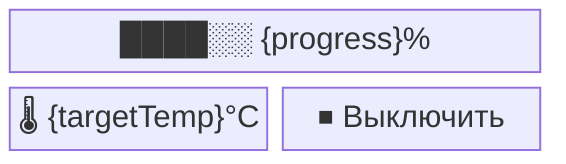

# Proposal: Print progress в `status.units[]`

**Status:** draft
**Owner:** —
**Created:** 2026-05-25

## Цель

Показывать прогресс печати Bambu (0–100 %) в портале на плашке iHeater Link.
Сейчас прогресс приходит на ESP в `BambuPrinterStatus.progressPercent`, но
не уходит в `idryer/{serial}/status`, поэтому в портале невидим.

## Контрактные изменения

`contracts/mqtt_contract.yaml`, секция `status.units[i]`:

```yaml
progress:
  type: integer
  unit: "%"
  range: [0, 100]
  optional: true
  description: |
    Прогресс активной операции (печать Bambu, профиль сушки).
    Отсутствует при IDLE и для устройств без источника прогресса.
```

## Слои и шаги

1. **Контракт** — добавить поле, обновить `mqtt_contract.schema.json`.
2. **Регенерация** — `bash contracts/regen.sh`. Проверить diff в
   `_generated/mqtt-api.types.ts` и копию в `frontend-v2/src/contracts/`.
3. **`iDryer-core`** — `iDryer.cpp::publishStatusNow` добавляет
   `u["progress"] = status.progress[i]` если `> 0`.
4. **`iHeater-link`** — `auto_heat.cpp::onBambuPrinterStatusUpdate` копирует
   `status.progressPercent` → `device().status.progress[0]` при `heating=true`.
   При `applyStop` обнулять.
5. **Backend** — `mqtt-telemetry/handlers/status.handler.ts::broadcastStatusUpdate`
   добавляет `progress: unit.progress` в WS payload `status:update`.
6. **Frontend type** — `frontend-v2/src/types/device.ts::DeviceUnit` поле
   `progress?: number | null`.
7. **Live-обновление** —
   `DeviceDetailPage.tsx::handleStatus` и
   `components/dashboard/DynamicCard.tsx::handleStatus` прокидывают
   `progress` в react-query (паттерн `target.temperature`).
8. **Виджет** — `contracts/widgets/HeaterControl.tsx` в ветке `isHeating`
   рендерит линейный прогресс-бар при `progress != null`. Раскладка и
   биндинги — см. раздел «[Макет виджета](#макет-виджета)» ниже.
9. **i18n** — переиспользовать существующие ключи (поискать `progress`,
   `percent`). Новые не плодить.
10. **Регенерация виджетов** — `bash contracts/regen.sh` (копирует
    `HeaterControl.tsx` в `frontend-v2/src/components/widgets/`).

## Макет виджета

`HeaterControl` имеет два состояния. Mermaid `block-beta` задаёт раскладку
(колонки/строки), таблица под диаграммой — биндинги:

- `←` — источник данных (read).
- `→` — invoke-действие (write).
- `↕` — локальный draft-state виджета.
- `{x}` — плейсхолдер, раскрывается биндингом из таблицы.

Контракт описывает **поведение и привязки**, а не пиксельный дизайн.
Реализации в портале (`.tsx`) и в приложении должны воспроизводить
ту же раскладку и те же биндинги; визуальное оформление —
ответственность каждой платформы.

### State: HEATING — `device.deviceStatus == "DRYING"`



| Элемент  | Bind |
|----------|------|
| `target` | ← `device.units[0].targetTemperature ?? device.units[0].target.temperature` |
| `bar`    | ← `device.units[0].progress` — весь блок скрыт при `progress == null` |
| `stop`   | → invoke `heat.stop` |

### State: IDLE


| Элемент | Bind |
|---------|------|
| `temp`  | ↕ `draftTemp` (40..120, шаг 5, °C) |
| `dur`   | ↕ `draftDuration` (0..480, шаг 15, min; `0` отображается как `∞`) |
| `label` | ← `resolveRoleLabel(item, lang)` |
| `start` | → invoke `heat.start { tempC: draftTemp, durationMin: draftDuration }` |

## Acceptance

- `mosquitto_sub` отправляет `progress` в `status` при `mode=DRYING`
- В DevTools → Network → WS `status:update` содержит `progress`.
- На плашке iHeater Link во время `DRYING` виден прогресс-бар, обновляется при каждом push_status.
- При `IDLE` прогресс-бар скрыт.

## Ограничения

- В Moonraker (Klipper) аналогичное поле — `print_stats.progress` (0..1).
  Семантика та же, шкалу привести к `[0, 100]` на ESP при необходимости.
- На устройствах без источника прогресса (Dryer) поле не публикуется —
  виджет проверяет `progress != null`.

## Связанные файлы

- `lib/idryer-core/src/integrations/bambu/bambu_client.cpp` — источник
  `progressPercent`.
- `lib/idryer-core/src/iDryer.cpp` — публикация `status`.
- `src/heater/auto_heat.cpp` — точка интеграции в iHeater-link.
