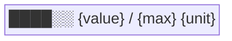
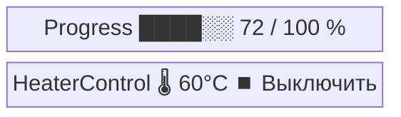

# Виджет: `progress`

**Status:** draft
**Created:** 2026-05-25
**Role:** `progress`
**Widget:** `Progress`

## Зачем

Универсальный виджет: бар со значением в диапазоне и единицей измерения.
Самостоятельный кирпич в карточке устройства, рядом с другими виджетами.

Один виджет покрывает любые «значение в диапазоне»:

| Кейс                       | value | max  | unit  |
|----------------------------|-------|------|-------|
| Печать Bambu               | 72    | 100  | `%`   |
| Остаток филамента          | 0.3   | 1.0  | `kg`  |
| Время до конца сушки       | 15    | 60   | `min` |
| Расход материала           | 15    | 50   | `шт`  |

Первый потребитель — печать Bambu на iHeater Link.

## Что есть сейчас

В карточке iHeater Link виджета для отображения такого значения нет.
Источник данных существует на ESP (`BambuPrinterStatus.progressPercent`),
но дальше по цепочке не уходит: роли в контракте нет, пункта меню нет,
поля в `status.units[i]` нет.

## Что хотим

Новый виджет `Progress`, появляется в карточке устройства когда:

1. В `device.menu[]` есть пункт с `r: "progress"` (устройство декларирует
   способность сообщать значение).
2. В `device.units[i].progress` есть объект со значениями (есть что
   показывать).

Макет:



| Элемент | Bind                         | Поведение                                |
|---------|------------------------------|------------------------------------------|
| `bar`   | ← `device.units[i].progress` | весь виджет скрыт при `progress == null` |

Поля `progress`:

| Поле    | Тип    | Обязат. | Описание                                       |
|---------|--------|---------|------------------------------------------------|
| `value` | number | да      | текущее значение                               |
| `max`   | number | да      | верхняя граница                                |
| `unit`  | string | да      | единица измерения (`%`, `kg`, `min`, `шт`, …)  |
| `min`   | number | нет     | нижняя граница (по умолчанию `0`)              |

Заполнение бара: `(value - min) / (max - min)`.

В карточке iHeater Link `Progress` встанет отдельным блоком рядом с
`HeaterControl`:



## Что меняем в контракте

**1. Canonical role.** `mqtt_contract.yaml → canonical_roles`:

```yaml
progress:
  widget: Progress
  description: |
    Бар со значением в диапазоне и единицей измерения.
    Источник определяется устройством (печать, остаток, расход, ...).
```

**2. Поле статуса.** `mqtt_contract.yaml → status.units[i]`:

```yaml
progress:
  type: object
  optional: true
  properties:
    value:
      type: number
    max:
      type: number
    unit:
      type: string
      examples: ["%", "kg", "min", "шт"]
    min:
      type: number
      default: 0
      optional: true
```

**3. Меню устройства.** Прошивка iHeater Link при наличии подключения
к Bambu публикует в `idryer/{serial}/config` пункт меню:

```json
{"id": <n>, "r": "progress", "t": "val"}
```

При отключении Bambu пункт исчезает из меню.

## Готово, когда

- В `idryer/{serial}/config` у iHeater Link с подключённым Bambu есть
  пункт меню `r: "progress"`. Без Bambu пункта нет.
- В `idryer/{serial}/status` поле `units[0].progress` приходит как
  объект, например `{value: 72, max: 100, unit: "%"}` пока идёт печать.
- В карточке iHeater Link в портале виден отдельный виджет с полосой
  и подписью `72 / 100 %`, рядом с `HeaterControl`.
- При отсутствии данных виджет либо скрыт (нет пункта меню), либо
  показан без значения (пункт есть, `progress == null`) — в обоих
  случаях бара не видно.
